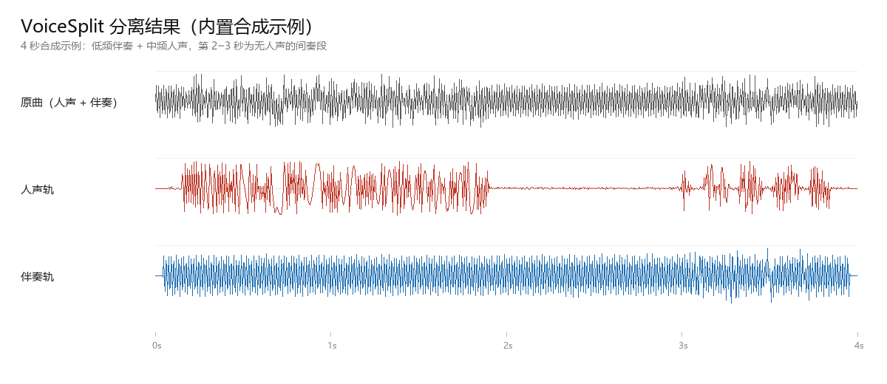
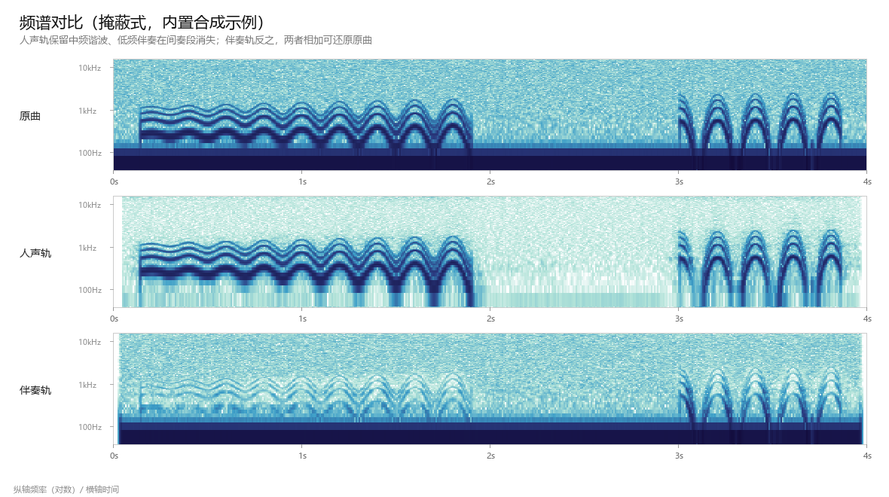

# VoiceSplit

**English** | [中文](#中文文档)

Offline vocal / accompaniment separation with a GUI. Bundles MDX-Net models, runs entirely
on local CPU — no network calls, no uploads.

**[中文文档在下半部分 →](#中文文档)**



<sub>Waveform view: the vocal track (red) goes quiet during the instrumental interlude at 2–3 s,
while the accompaniment (blue) keeps playing. Reproduce with `python scripts/make_figures.py`.</sub>

## Features

- **Two extraction algorithms** — complement (fast) and **masking** (cleaner). Masking turns
  model output into a 0–1 weight map applied directly to the original spectrum, so
  low-confidence regions stay in the accompaniment instead of bleeding into the vocal.
- **Three strength levels** — `normal` / `strong` / `isolate`. `isolate` runs a second
  iterative pass; measured background-music residue on a full song drops to **0.24%**.
- **Multichannel aware** — detects 5.1/7.1 sources and uses the center channel as a prior
  (surround mixes usually put vocals in the center). Biggest win on loud-backing-track songs.
- **Automatic model adaptation** — derives FFT parameters from each ONNX input shape, so
  models with different window sizes (6144 / 5120 / 4096) can be mixed freely.
- **Segment replacement** — splices a re-processed fragment back into a master track with
  automatic offset detection (compensates MP3 encoder delay), 20 ms crossfades, and zero
  changes outside the replaced range.

## Install

Python 3.10+ (developed on 3.12).

```bash
pip install -r requirements.txt
python scripts/download_models.py      # downloads models (mirror-first)
```

ffmpeg: either drop `ffmpeg.exe` into `ffmpeg/` in the repo root, or install it on `PATH`
(`ffmpeg -version` should work).

## Usage

GUI:

```bash
python gui.py
```

> Widget-by-widget guide (including the packaged .exe): [docs/gui-guide.md](docs/gui-guide.md)

Self-check (verifies ffmpeg, models, inference chain, and runs a full pass):

```bash
python gui.py --selftest
```

As a library:

```python
import core

# Recommended for songs: masking + vocal-first + extreme isolation
core.separate(
    "song.flac", "./out",
    model_set="标准（推荐）",   # or "人声突显（歌曲）"
    vocal_boost=True,           # stronger vocal model + center-channel prior
    strength="isolate",         # normal / strong / isolate
    fmt=("flac",),
)
```

## Choosing a strength level



<sub>Same demo, spectrogram view (log frequency, shared colour scale): the vocal track keeps the
mid-band harmonics and loses the low-frequency accompaniment, the accompaniment track does the
reverse. The two sum back to the original.</sub>

Measured on a full 3:45 song:

| Strength | Background-music residue | Vocal-band retention | Runtime |
|---|---|---|---|
| `normal` | 12.1% | 81% | ~4 min |
| `strong` | 1.2% | 57% | ~4 min |
| `isolate` | **0.24%** | 59% | ~8 min |

*Residue* = vocal-track energy at 30–120 Hz ÷ original energy in the same band (vocals have
almost no low end, so lower is cleaner). *Retention* = vocal-track energy at 300–3000 Hz ÷
original in the same band.

**Trade-off**: `isolate` and `strong` gate down time frames with low vocal probability
(interludes, breaths, breathy tails), which sounds drier and choppier. When vocals and music
occupy the same time-frequency region (chorus with strings), the model cannot separate them —
an aggressive threshold will cut vocals too. Fall back to `normal` there.

## Model tiers

| Tier | Vocal model | Accompaniment model |
|---|---|---|
| 标准（推荐） | Kim_Vocal_2 | UVR-MDX-NET-Inst_HQ_3 |
| 人声突显（歌曲） | kuielab_b_vocals | UVR-MDX-NET-Inst_HQ_3 |
| 高精度 | UVR-MDX-NET-Voc_FT | UVR-MDX-NET-Inst_HQ_4 |
| 轻量快速 | Kim_Vocal_2 | UVR-MDX-NET-Inst_Main |

Drop any MDX-Net `.onnx` into `models/` to extend the list (a vocal/accompaniment pair is
required for a tier to show up).

## Output convention

- Both stems are true-peak limited to about −1.4 dBTP; no clipped samples. Default output
  gain 0.95 (adjustable).
- Vocal + accompaniment sums back to the original down to quantization noise
  (mean deviation < 0.5 LSB).
- The last ~0.04 s and the first 50 ms are algorithmic fade regions.

## Project layout

```
core.py                        separation core: STFT / inference / masking / limiting / segment splice
gui.py                         tkinter GUI + --selftest
scripts/download_models.py     model download (SHA256 verified, mirror fallback)
scripts/publish_models.py      publish weights as GitHub Release assets
scripts/build_exe.py           package as a Windows .exe (PyInstaller)
scripts/demo_strength.py       objective comparison across the three strength levels
scripts/make_figures.py        regenerate the README figures from a synthetic demo
scripts/make_icon.py           generate the app icon
tests/test_core.py             synthetic self-check
docs/gui-guide.md              widget-by-widget GUI guide (EN + 中文)
docs/images/                   README figures (generated, safe to regenerate)
```

## Model provenance and licensing

Weights are third-party and **not shipped in this repository**. Get them with
`scripts/download_models.py`:

- Kim_Vocal_2 / UVR-MDX-NET-* — trained and released by the
  [Ultimate Vocal Remover](https://github.com/Anjok07/ultimatevocalremovergui) project
- kuielab_b_* — KUIELab music separation models

Their licensing status is unclear (the UVR repository does not state a license for the
weights). Personal study and research use is fine; **confirm rights before commercial use**.
This repository ships code only — see LICENSE.

## Known limitations

- Separation quality is bounded by the source: when vocals and music overlap in the same
  time-frequency region, no clean split exists.
- The 5.1 path assumes vocals are mainly in the center channel. Mixes that break that
  convention gain nothing from the prior.
- CPU only, no GPU acceleration. A 3–4 minute song takes roughly 4–8 minutes.

## Contributors

See [CONTRIBUTORS.md](CONTRIBUTORS.md).

- **YAOXIAOYUAN0802** — project owner: requirements, acceptance criteria, real-world testing
- **DeepSeek Harness** (AI pair programmer) — architecture and implementation

## License

MIT (covers this repository's code only).

---

# 中文文档

**中文** | [English](#voicesplit)

离线运行的人声与伴奏分离工具，带图形界面。内置 MDX-Net 模型，全程本机 CPU 推理，
不联网、不上传任何文件。


<sub>波形视图：2~3 秒的器乐间奏里人声轨（红）安静下来，伴奏轨（蓝）继续；分离效果可用
`python scripts/make_figures.py` 自行复现。</sub>

## 特性

- **两种提取算法**：互补式（快）与掩蔽式（干净）。掩蔽式把模型输出当作 0~1 权值直接过滤
  原曲频谱，模型没把握的地方能量留在伴奏轨，不会糊进人声。
- **三档分离强度**：常规 / 强分离 / 纯人声（极端隔离）。极端隔离用两趟迭代提取，
  实测整首歌背景音乐残留可压到原曲的 **0.24%**。
- **多声道感知**：识别 5.1/7.1 素材，会用中置声道做先验（环绕混音里人声通常就在中置），
  对"背景音乐太大"的歌曲帮助最大。
- **自动适配模型**：读取 ONNX 输入形状推导 FFT 参数（6144 / 5120 / 4096 三种模型族混用无碍）。
- **片段替换**：自动测量对齐偏移（补偿 MP3 编码延时）、20ms 交叉淡化、替换区外零改动。

## 安装

需要 Python 3.10+（开发环境为 3.12）。

```bash
pip install -r requirements.txt
python scripts/download_models.py      # 下载模型（国内默认走 hf-mirror 镜像）
```

ffmpeg 请任选一种方式：

- 放到仓库根目录下的 `ffmpeg/ffmpeg.exe`（Windows），或
- 安装到系统 PATH（`ffmpeg -version` 能跑即可）

## 使用

图形界面：

```bash
python gui.py
```

> 图形界面各控件的详细说明（含打包成 exe 后的使用方式）见
> [docs/gui-guide.md](docs/gui-guide.md)。

自检（逐项检查 ffmpeg、模型、推理链路，并跑一遍完整流程）：

```bash
python gui.py --selftest
```

作为库调用：

```python
import core

# 推荐配置：掩蔽式 + 人声优先 + 极端隔离
core.separate(
    "song.flac", "./out",
    model_set="标准（推荐）",   # 或 "人声突显（歌曲）"
    vocal_boost=True,           # 人声优先：换更强的模型 + 中置先验
    strength="isolate",         # normal / strong / isolate
    fmt=("flac",),              # 另出 FLAC
)
```

## 分离强度怎么选


<sub>同一示例的频谱视图（对数频率轴，全图共用色标）：人声轨保留中频谐波、失去低频伴奏，
伴奏轨反之，两者相加可还原原曲。</sub>

整首歌（3:45）实测数据，供取舍参考：

| 强度 | 背景音乐残留 | 人声频段保留 | 耗时 |
|---|---|---|---|
| 常规 `normal` | 12.1% | 81% | 约 4 分钟 |
| 强分离 `strong` | 1.2% | 57% | 约 4 分钟 |
| 纯人声 `isolate` | **0.24%** | 59% | 约 8 分钟 |

"背景音乐残留"= 人声轨 30–120Hz 能量 ÷ 原曲同频段能量（人声几乎没有低频，所以这个值越低
说明音乐去得越干净）。"人声频段保留"= 人声轨 300–3000Hz 能量 ÷ 原曲同频段能量。

**代价**：`isolate` 与 `strong` 会把人声概率低的时段（间奏、换气、气声尾音）整体压低，
听起来偏"干、断续"。如果人声和音乐同时出现（副歌人声+弦乐齐奏），模型判据分不开，
更狠的阈值会连人声一起削——这种情况请退回 `normal`。

## 模型档位

| 档位 | 人声模型 | 伴奏模型 |
|---|---|---|
| 标准（推荐） | Kim_Vocal_2 | UVR-MDX-NET-Inst_HQ_3 |
| 人声突显（歌曲） | kuielab_b_vocals | UVR-MDX-NET-Inst_HQ_3 |
| 高精度 | UVR-MDX-NET-Voc_FT | UVR-MDX-NET-Inst_HQ_4 |
| 轻量快速 | Kim_Vocal_2 | UVR-MDX-NET-Inst_Main |

把任意 MDX-Net 的 `.onnx` 放进 `models/` 即可扩展档位（需要人声/伴奏成对出现才会显示）。

## 输出约定

- 两条音轨默认真峰值控制在 −1.4 dBTP 以内，无削顶样本；输出电平默认 0.95 倍（可调）。
- 人声 + 伴奏相加可还原原曲至量化噪声级别（平均偏差 < 0.5 个量化级）。
- 结尾约 0.04 秒、开头 50ms 为算法边缘淡入淡出区。

## 项目结构

```
core.py                 分离核心：STFT/推理/掩蔽/限幅/片段替换
gui.py                  图形界面 + --selftest 自检
scripts/download_models.py   模型下载（带 SHA256 校验，镜像回退）
scripts/publish_models.py    把模型权重发布为 GitHub Release 附件
scripts/build_exe.py    打包为 exe（PyInstaller）
scripts/demo_strength.py     三档强度对比实验，输出客观指标
scripts/make_figures.py 生成 README 配图（合成示例，可复现）
scripts/make_icon.py    生成程序图标
tests/test_core.py      合成信号自检
docs/gui-guide.md       图形界面逐控件说明（中英双语）
docs/images/            README 配图
```

## 模型来源与许可证

模型权重来自第三方，**不随本仓库分发**，请用 `scripts/download_models.py` 自行下载：

- Kim_Vocal_2 / UVR-MDX-NET-* ：由 [Ultimate Vocal Remover](https://github.com/Anjok07/ultimatevocalremovergui) 项目训练发布
- kuielab_b_* ：KUIELab 音乐分离模型

这些权重的授权状态并不明确（UVR 仓库未给出明确的权重许可）。用于个人学习、研究没有问题，
**商业用途请先自行确认权利**。本仓库只包含代码，代码部分见 LICENSE。

## 已知限制

- 除 `isolate` 外，分离质量取决于原曲本身：人声与音乐同时占据同一时频区域时无法干净分离。
- 5.1 素材依赖一个近似假设——人声主要在中置声道。若混音不遵循该惯例，中置先验会无收益。
- 无 GPU 加速，纯 CPU 推理；3~4 分钟歌曲约 4~8 分钟。

## 贡献者

见 [CONTRIBUTORS.md](CONTRIBUTORS.md)。

- **YAOXIAOYUAN0802** —— 项目发起人：需求、验收标准、真实素材实测
- **DeepSeek Harness**（AI 协作代理）—— 架构设计与代码实现

## License

MIT（仅覆盖本仓库代码）
